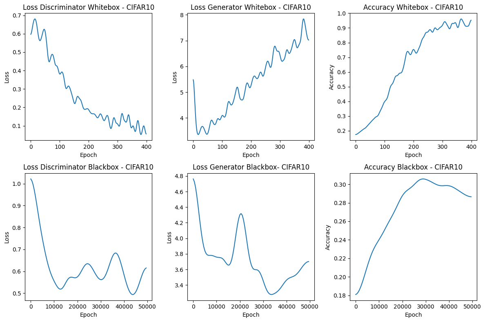
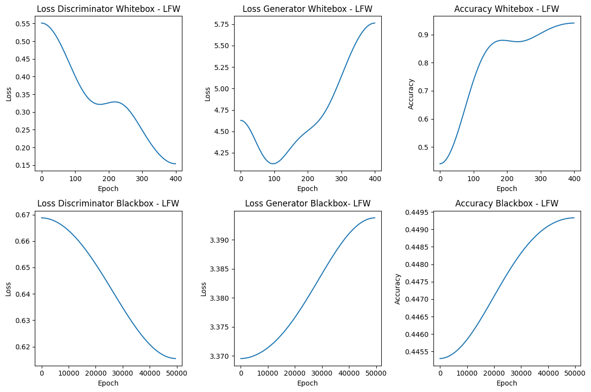
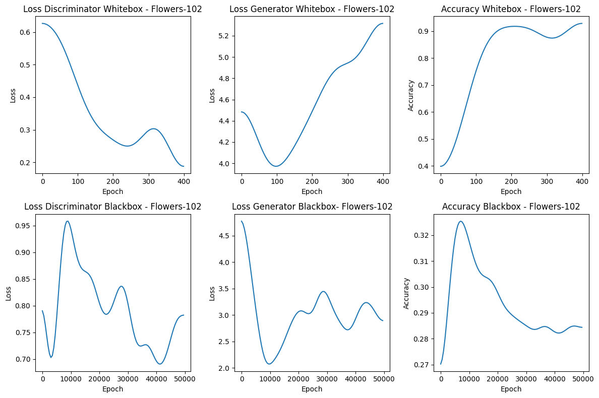

# Membership Inference Attacks against Generative Adversarial Networks(GAN)

## Overview

This is an implementation of a membership inference attack against a GAN.

The procedure, as well as the conclusions, are available in the listed article[1].

The network used was not necessarily state-of-the-art in terms of complexity and architecture, instead it was used as proof-of-concept for running a membership inference attack.

### Examples

The following represent the samples generated by the network as it progresses through training.

At some point, the generated samples stop exhibiting any significant changes, showing that the network reached "its full potential" in learning the image distribution.

#### CIFAR10 demo

#### LFW demo

#### Flowers demo

## Description

The implementation features 3 parts:

* GAN network implementation[2] - DCGAN(Deep Convolutional GAN)
* Whitebox attack
* Blackbox attack

There are 3 datasets that have been used for testing:

* CIFAR10 - 10 class labeled images
* LFW - Labeled Faces in the Wild
* Flowers102 - Containing 102 species of flowers

The attacks are ran at different stages of training(epochs), and are reported in the csv files. The 'results.ipynb' notebook can be used to view the results.

* For the whitebox attack, we simply use the original(target) discriminator model to discern whether a sample belongs to the training dataset.

* For the blackbox attack, we train an additional GAN network to try and 'mimic' the target model, and use this model's discriminator for inference. This is done by querying the target model to generate samples that will be used as reference images("real" images) in training the attack model, thus learning the image distribution in the seed vector space of the target model.

To decide if a data point(image) belongs to the training dataset, confidence in classifying the image as real is used, taking the most confidently classified samples to be real as belonging to the training dataset. Thus, the attack accuracy is calculated as the ratio between the number of actual members of the training dataset and the entire sample size(in Machine Learning, this is also known as recall).

### Examples

Furthermore, we can see demos from the blackbox attack network as it progresses through training and tries to immitate the attacked model.

#### Blackbox CIFAR10 demo

#### Blackbox LFW demo

#### Blackbox Flowers demo

## Results

These are the results of the aforementioned described implementation

#### CIFAR10

#### LFW

#### Flowers

## References

[1] https://arxiv.org/abs/1705.07663
[2] https://github.com/jhayes14/gen_mem_inf