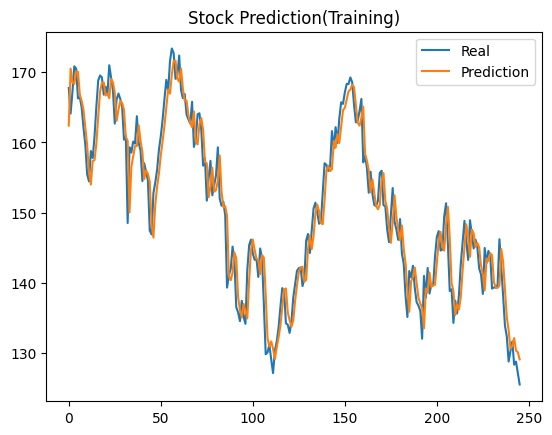
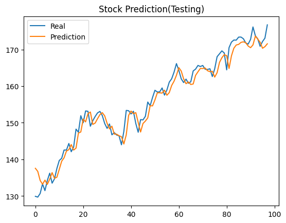

# Time Series Forecasting

## Overview

In this mini-project, I tried to predict the stock value for the Apple company.

## Description

The model architecture is a simple LSTM(Long Short Term Memory) network which was trained on the Apple stock data downloaded from Yahoo Finance[1] over the course of one year and a half.

For testing, I used the following half of year.

The training was performed using a "sliding window" on the data, taking window-sized chunks of data and building the training set for the model, the purpose being to predict the last item in the window.

## Results

Here are the results of the model. The model performed pretty well in my opinion, a little above my expectations.

#### After the training

#### Testing

## References

[1] https://finance.yahoo.com/